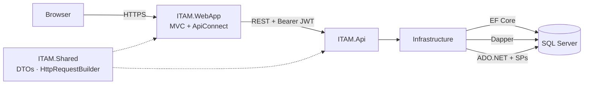

# ITAM QUOM — Arquitectura e Identity

## Topología runtime (MVC → API → BD)

Regla Daikin: **solo la API tiene acceso a SQL Server**. El MVC habla por HTTP + JWT.



| Tramo | Cómo |
|---|---|
| **WebApp → Api** | `HttpRequestBuilder` / `BaseHttpRepository` (ApiConnectV2), token en `WithBearer` |
| **Api → BD** | EF (Identity + catálogos/CRUD), Dapper (listados/historial), ADO.NET+SP (asignar/devolver) |
| **WebApp ↛ BD** | Sin `SqlConnection`, sin referencia a Infrastructure |

Canvas interactivo (Cursor): vista **0 · Arquitectura** en `itam-modelo-datos.canvas.tsx`.

## Capas

| Proyecto | Responsabilidad |
|---|---|
| **ITAM.Domain** | Contratos (`Interfaces`), reglas puras. Sin EF / SQL / HTTP. |
| **ITAM.Application** | Casos de uso futuros (orquestación). |
| **ITAM.Infrastructure** | Identity + EF, repos ADO.NET/SPs / Dapper, DI. |
| **ITAM.Shared** | DTOs, enums de rol, `JwtSettings`, ApiConnect para MVC. |
| **ITAM.Api** | Controllers, JWT Bearer, Swagger. Único host con acceso a BD. |
| **ITAM.WebApp** | MVC; consume la API por HTTP (sin BD). |

```
Controller → IAuthService (Domain) → AuthService (Infrastructure / Identity)
```

## Interfaces (Domain)

### `IAuthService`
- **Archivo:** `ITAM.Domain/Interfaces/Services/IAuthService.cs`
- **Impl:** `ITAM.Infrastructure/Services/AuthService.cs`
- **Método:** `LoginAsync(LoginDto)` → `Result<LoginResultDto>` (sin JWT).
- El **JWT** lo genera `AuthController` con claims: `sub`, `email`, `identityUserId`, `displayName`, `ClaimTypes.Role`.

Nuevas interfaces de negocio irán en `ITAM.Domain/Interfaces/` (Services y Repositories) e implementación en Infrastructure.

## Auth — decisiones

| Tema | Decisión |
|---|---|
| Usuarios | `ApplicationUser : IdentityUser<Guid>` |
| Roles | `Administrador`, `Operador` (Identity Role + claim) |
| Hash | ASP.NET Identity (no texto plano) |
| Token | JWT Bearer (`JwtSettings` en appsettings) |
| Negocio | EF (CRUD) + ADO.NET/SP (asignar) + Dapper (reportes) |
| Identity schema | EF Core migraciones **manuales** |
| Logs | Serilog en `wwwroot/App_Data/logs/` (portable al publish MonsterASP; App_Data no se sirve como estático) |
| Excepciones | `ExceptionHandlingMiddleware` en API (ProblemDetails) y MVC (redirect Error) |
| SMTP | `SmtpSettings` en appsettings (reset/invite password) |

## Identity / DbContext (como Daikin, con Guid)

Daikin:
```csharp
public class ApplicationDbContext : IdentityDbContext { } // IdentityUser/Role string
services.AddIdentity<IdentityUser, IdentityRole>()
    .AddEntityFrameworkStores<ApplicationDbContext>();
```

ITAM QUOM (misma idea, PK Guid + ApplicationUser extendido):
```csharp
public class ApplicationDbContext : IdentityDbContext<ApplicationUser, IdentityRole<Guid>, Guid>
services.AddIdentity<ApplicationUser, IdentityRole<Guid>>()
    .AddEntityFrameworkStores<ApplicationDbContext>();
```
`base.OnModelCreating(builder)` es lo que registra las tablas `AspNet*`. No hace falta `DbSet` explícito.

## Migraciones (manual)

Comandos también documentados al inicio de `ITAM.Api/Program.cs`.

**Importante:** `dotnet ef` lee `appsettings` según `ASPNETCORE_ENVIRONMENT`.
En Development la cadena debe ser **local** (`localhost\SQLEXPRESS`). Si Development apunta a MonsterASP, las tablas AspNet se crean allá y en SSMS local no las ves.

```bat
dotnet ef database update ^
  --project ITAM.Infrastructure\ITAM.Infrastructure.csproj ^
  --startup-project ITAM.Api\ITAM.Api.csproj
```

```bat
dotnet ef migrations add <Nombre> ^
  --project ITAM.Infrastructure\ITAM.Infrastructure.csproj ^
  --startup-project ITAM.Api\ITAM.Api.csproj ^
  --output-dir Persistence/Migrations
```

El arranque **no** ejecuta `Database.Migrate()`. Solo hace seed de roles/usuarios si las tablas ya existen.

Si `migrations add` genera un `Up()` vacío, el modelo ya está cubierto por una migración anterior: no aplica cambios.

## Usuarios de prueba

| Email | Password | Rol |
|---|---|---|
| `admin@itam.local` | `Admin123!` | Administrador |
| `operador@itam.local` | `Operador123!` | Operador |

## Endpoints actuales

| Método | Ruta | Auth |
|---|---|---|
| GET | `/api/Status` | Anónimo |
| POST | `/api/Auth/login` | Anónimo |
| GET | `/api/Auth/me` | Bearer JWT |
